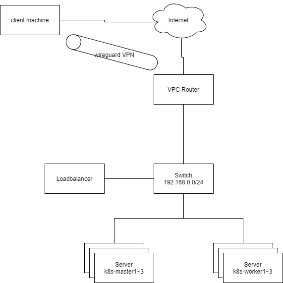

# kubernetes-practice-lab

k8s の勉強用

## トポロジ

### ネットワーク

| ネットワーク | CIDR          |
| ------------ | ------------- |
| wireguard    | 10.0.0.0/24   |
| lab          | 172.31.0.0/16 |
| lab-common   | 172.31.0.0/24 |

検証用ネットワークは lab ネットワークの第 3 オクテットをインクリメントする。

ただし、L2 では同じネットワークなので prefix は 16 で設定する必要がある。
| 検証ネットワーク | CIDR | 実際に設定する CIDR|
| --------------------------- | ------------- | --- |
| 01-k8s | 172.31.1.0/24 | 172.31.1.0/16 |
| 02-k8s-ingress-lb-appliance | 172.31.2.0/24 | 172.31.2.0/16 |
